## Generative Design

### [Complementary Colours](01_complementary_colours/)

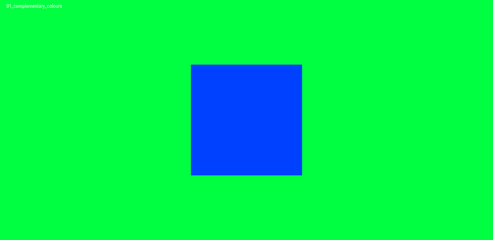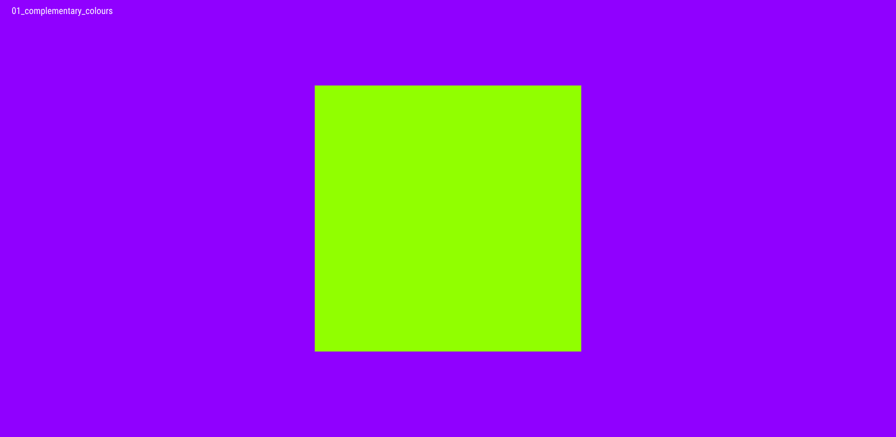

### [Colour Spectrum in a Grid](02_colour_spectrum_in_a_grid/)

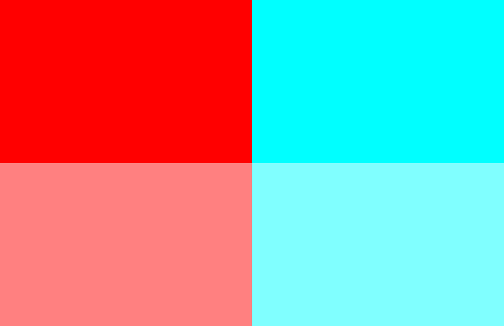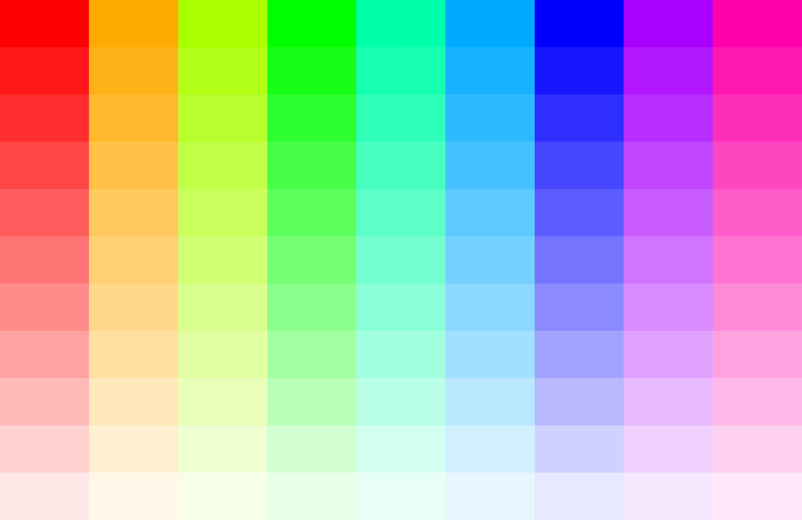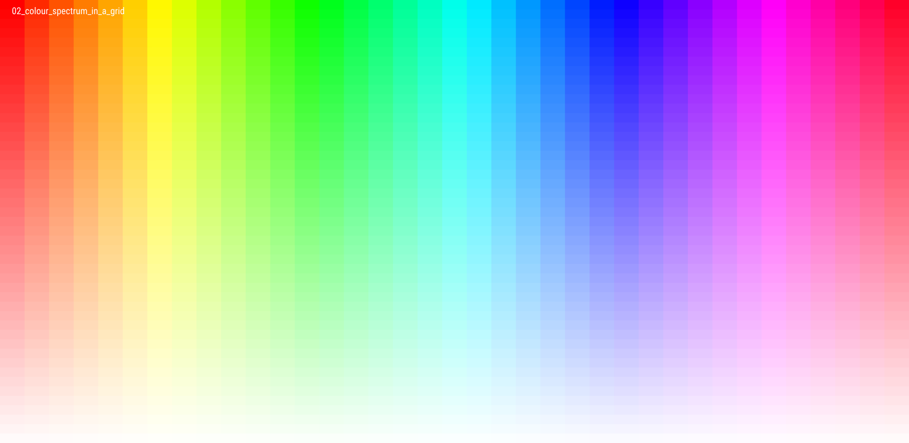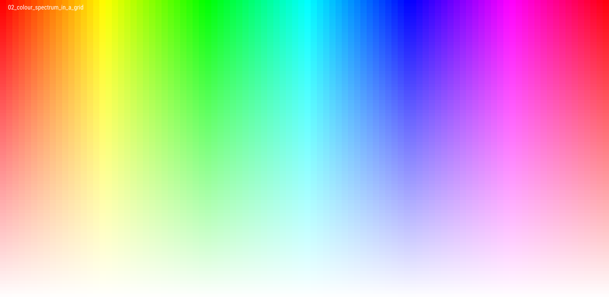

### [Colour Spectrum in a Circle](03_colour_spectrum_in_a_circle/)

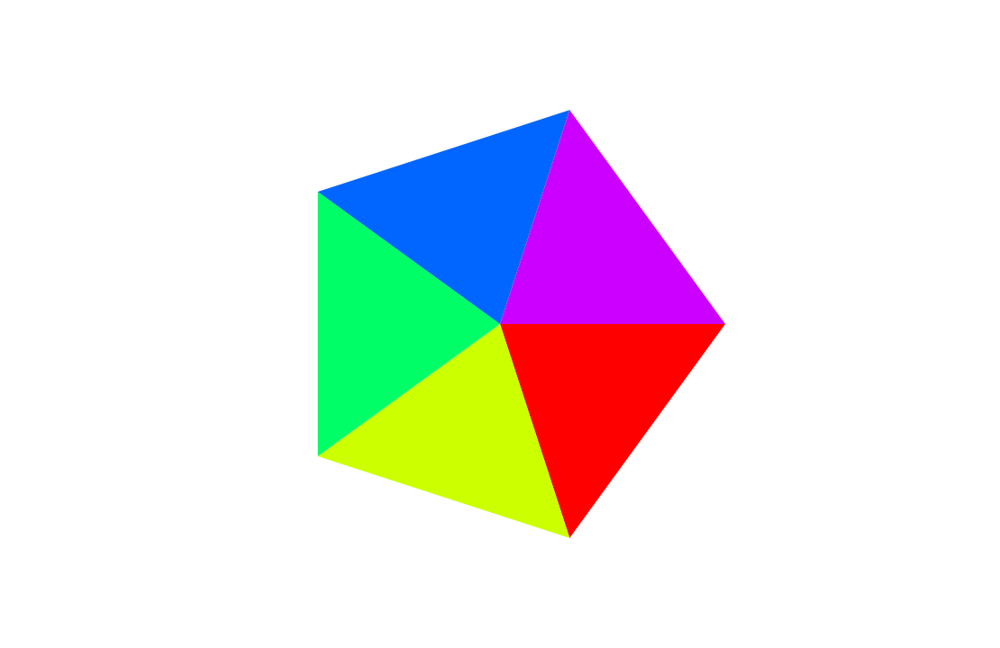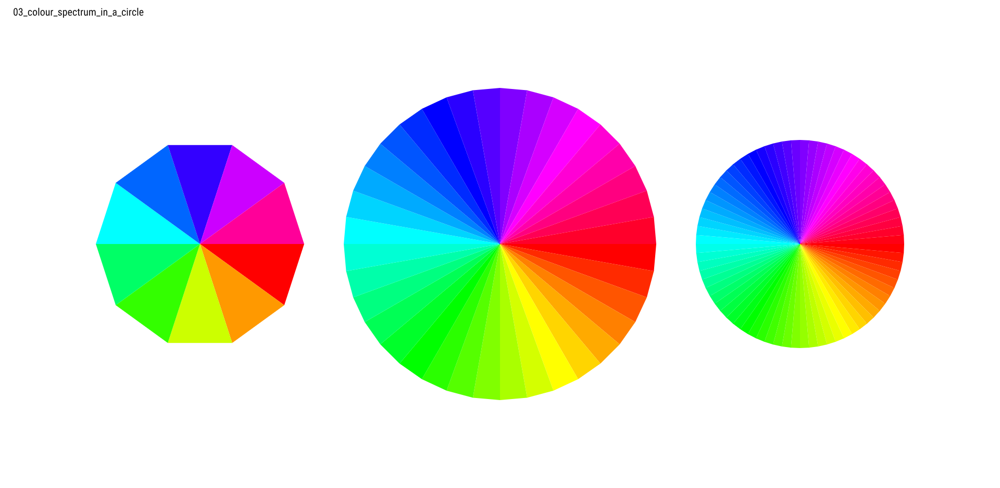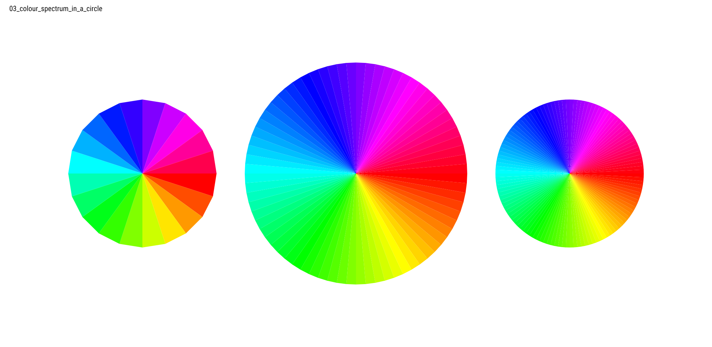

### [Colour Palettes Through Interpolation](04_colour_palettes_through_interpolation/)

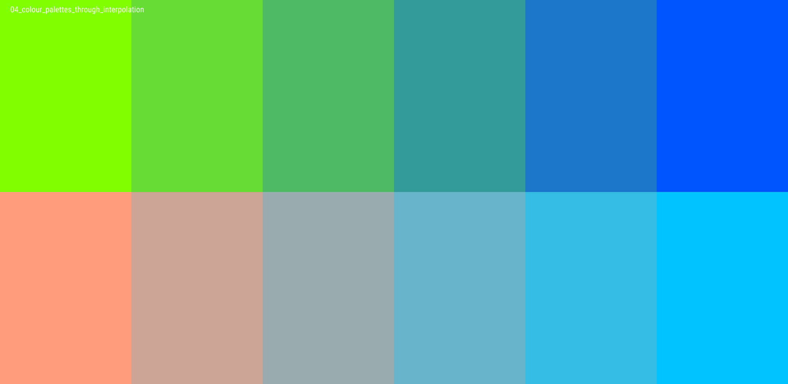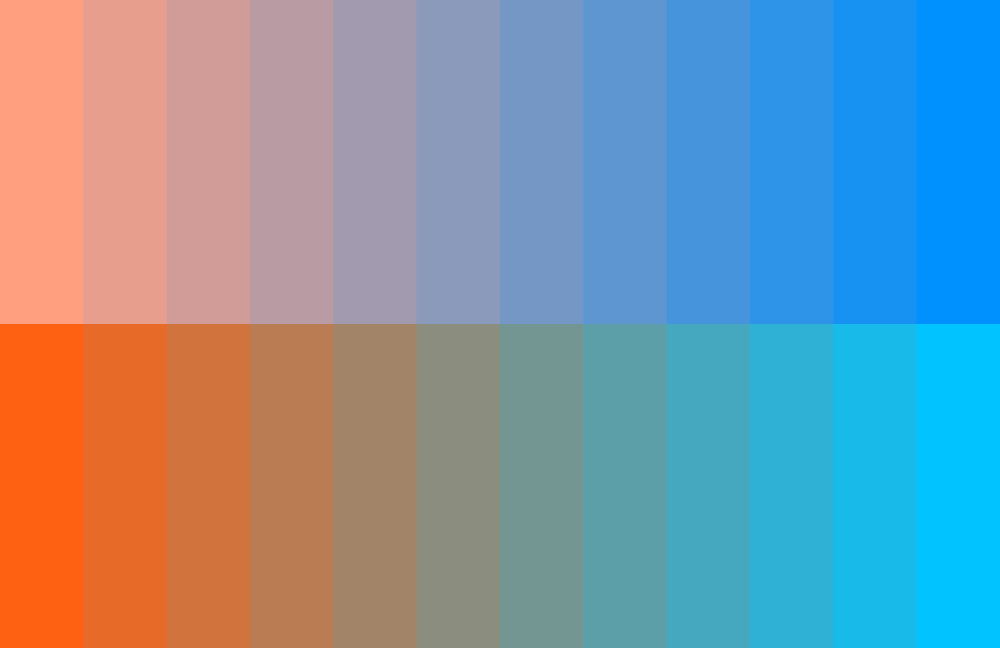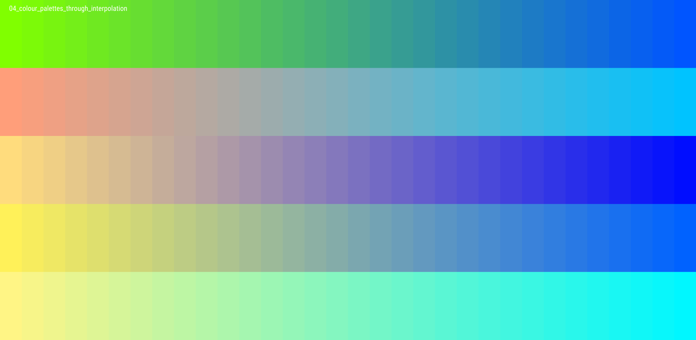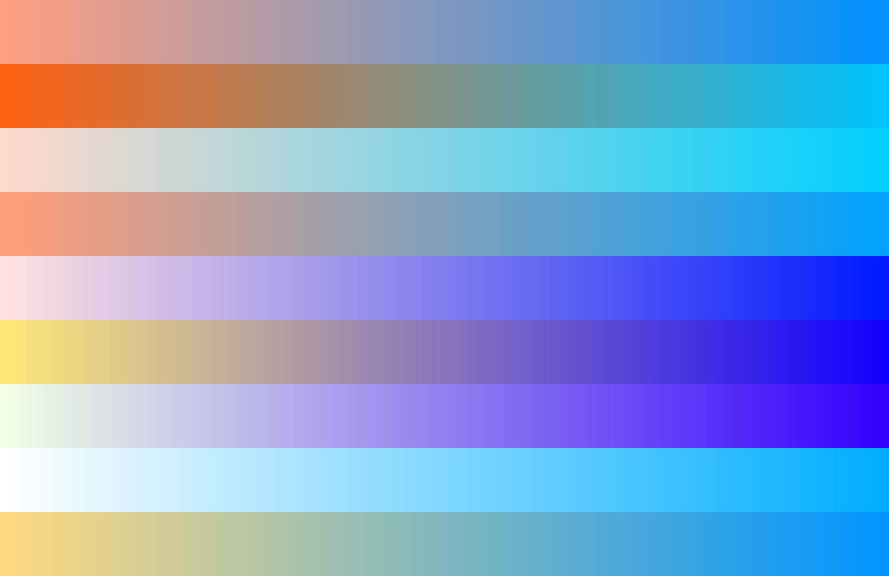

### [Colour Palettes from Images](05_colour_palettes_from_images/)

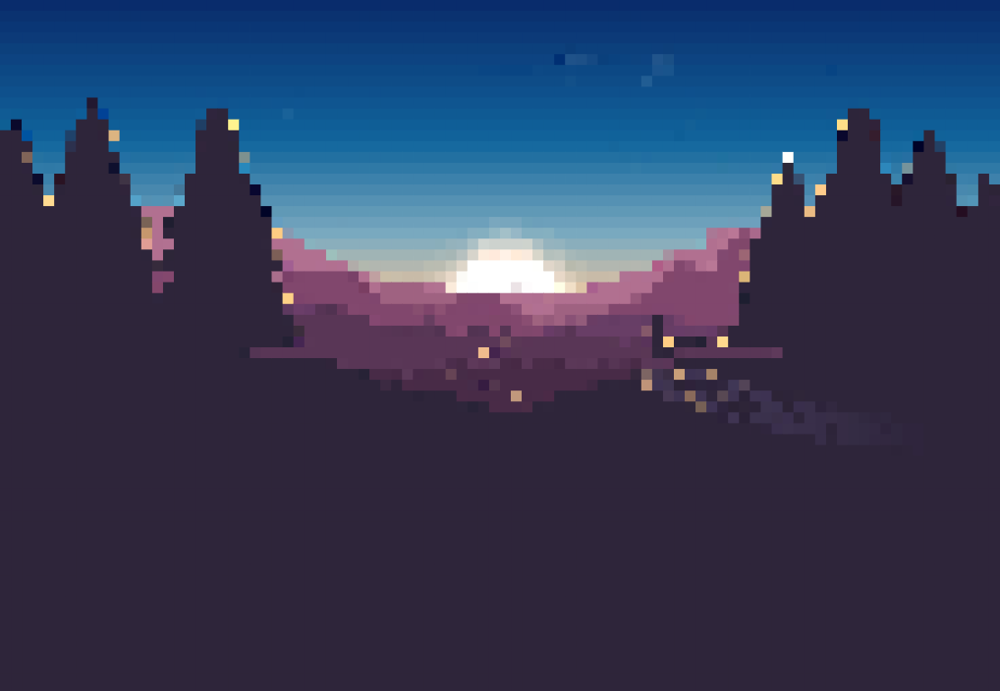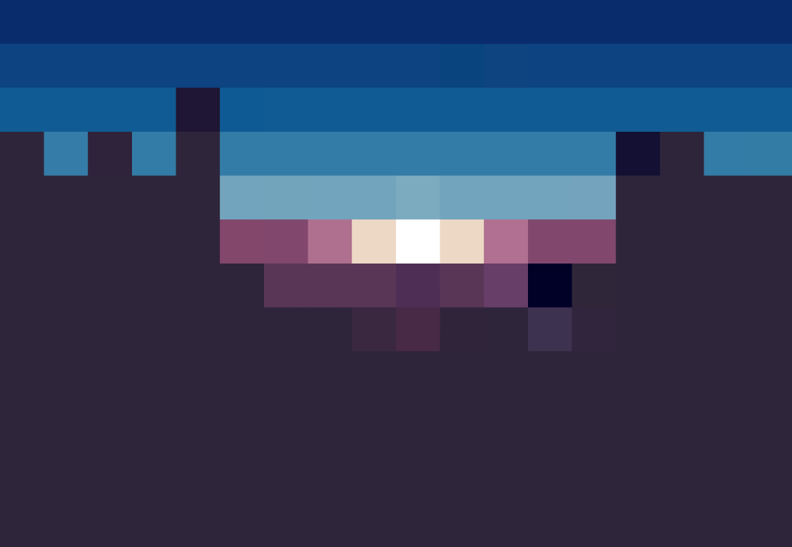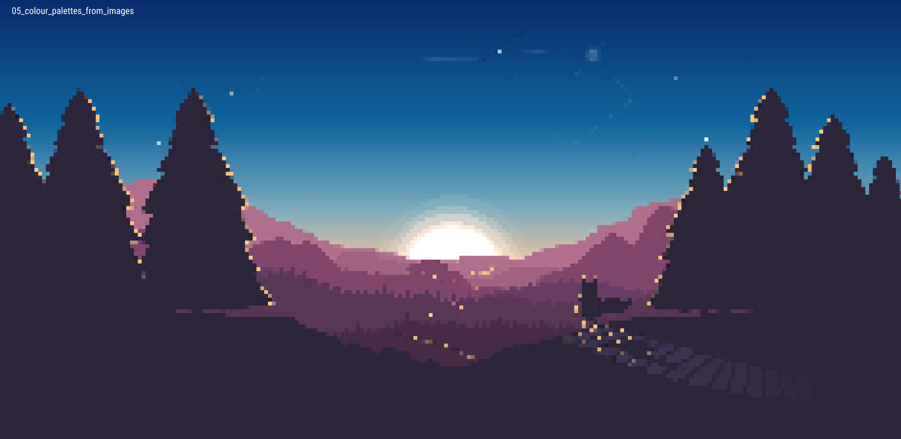

[<---](https://github.com/cilliantighe/Creative_Coding_GD)
