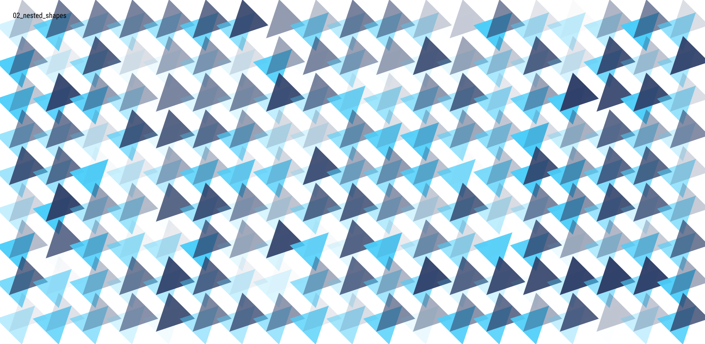
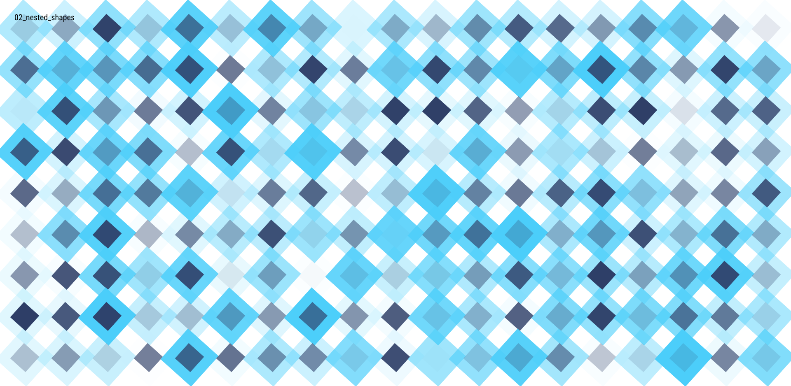

01_translations_4## Generative Design: Colour
In this section of the repository

### [Translations](01_translations/)

### [Nested Shapes](02_nested_shapes/)

### [Nested Patterns](03_nested_patterns/)

### [Nested Movement](04_nested_movement/)

### [Shape Displacement](05_shape_displacement/)

### [Shape Illusions](06_shape_illusions/)

[&lt;---](https://github.com/cilliantighe/Creative_Coding_GD)
